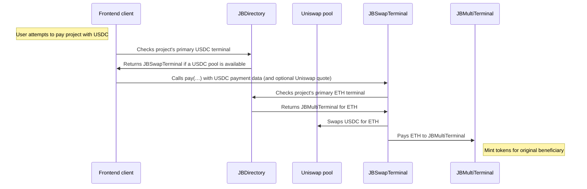

# Swap Terminal

A Juicebox terminal that accepts any token and swaps it for ETH (or the appropriate native token, like matic).

_If you're having trouble understanding this contract, take a look at the [core protocol contracts](https://github.com/Bananapus/nana-core) and the [documentation](https://docs.juicebox.money/) first. If you have questions, reach out on [Discord](https://discord.com/invite/ErQYmth4dS)._

## Usage

### Install

How to install `nana-swap-terminal` in another project.

For projects using `npm` to manage dependencies (recommended):

```bash
npm install @bananapus/swap-terminal
```

For projects using `forge` to manage dependencies (not recommended):

```bash
forge install Bananapus/nana-swap-terminal
```

If you're using `forge` to manage dependencies, add `@bananapus/swap-terminal/=lib/nana-swap-terminal/` to `remappings.txt`. You'll also need to install `nana-swap-terminal`'s dependencies and add similar remappings for them.

### Develop

`nana-swap-terminal` uses [npm](https://www.npmjs.com/) (version >=20.0.0) for package management and the [Foundry](https://github.com/foundry-rs/foundry) development toolchain for builds, tests, and deployments. To get set up, [install Node.js](https://nodejs.org/en/download) and install [Foundry](https://github.com/foundry-rs/foundry):

```bash
curl -L https://foundry.paradigm.xyz | sh
```

You can download and install dependencies with:

```bash
npm ci && forge install
```

If you run into trouble with `forge install`, try using `git submodule update --init --recursive` to ensure that nested submodules have been properly initialized.

Some useful commands:

| Command               | Description                                         |
| --------------------- | --------------------------------------------------- |
| `forge build`         | Compile the contracts and write artifacts to `out`. |
| `forge fmt`           | Lint.                                               |
| `forge test`          | Run the tests.                                      |
| `forge build --sizes` | Get contract sizes.                                 |
| `forge coverage`      | Generate a test coverage report.                    |
| `foundryup`           | Update foundry. Run this periodically.              |
| `forge clean`         | Remove the build artifacts and cache directories.   |

To learn more, visit the [Foundry Book](https://book.getfoundry.sh/) docs.

### Scripts

For convenience, several utility commands are available in `package.json`.

| Command                           | Description                            |
| --------------------------------- | -------------------------------------- |
| `npm test`                        | Run local tests.                       |
| `npm run test:fork`               | Run fork tests (for use in CI).        |
| `npm run coverage`                | Generate an LCOV test coverage report. |
| `npm run artifacts` | Fetch Sphinx artifacts and write them to `deployments/` |

### Deployments

#### With Sphinx

`nana-buyback-hook` manages deployments with [Sphinx](https://www.sphinx.dev). To run the deployment scripts, install the npm `devDependencies` with:

```bash
`npm ci --also=dev`
```

You'll also need to set up a `.env` file based on `.example.env`. Then run one of the following commands:

| Command                   | Description                  |
| ------------------------- | ---------------------------- |
| `npm run deploy:mainnets` | Propose mainnet deployments. |
| `npm run deploy:testnets` | Propose testnet deployments. |

Your teammates can review and approve the proposed deployments in the Sphinx UI. Once approved, the deployments will be executed.

#### Without Sphinx

You can use the Sphinx CLI to run the deployment scripts without paying for Sphinx. First, install the npm `devDependencies` with:

```bash
`npm ci --also=dev`
```

You can deploy the contracts like so:

```bash
PRIVATE_KEY="0x123…" RPC_ETHEREUM_SEPOLIA="https://rpc.ankr.com/eth_sepolia" npx sphinx deploy script/Deploy.s.sol --network ethereum_sepolia
```

This example deploys `nana-buyback-hook` to the Sepolia testnet using the specified private key. You can configure new networks in `foundry.toml`.

### Tips

To view test coverage, run `npm run coverage` to generate an LCOV test report. You can use an extension like [Coverage Gutters](https://marketplace.visualstudio.com/items?itemName=ryanluker.vscode-coverage-gutters) to view coverage in your editor.

If you're using Nomic Foundation's [Solidity](https://marketplace.visualstudio.com/items?itemName=NomicFoundation.hardhat-solidity) extension in VSCode, you may run into LSP errors because the extension cannot find dependencies outside of `lib`. You can often fix this by running:

```bash
forge remappings >> remappings.txt
```

This makes the extension aware of default remappings.

## Repository Layout

The root directory contains this README, an MIT license, and config files. The important source directories are:

```
nana-swap-terminal/
├── src/
│   ├── JBSwapTerminal.sol - The main swap terminal contract.
│   └── interfaces/ - Contains wETH interface (do not modify).
├── script/
│   ├── Deploy.s.sol - Deployment script.
│   └── helpers/ - Internal helpers for the deployment script.
└── test/
    ├── Fork/ - Fork tests.
    ├── Invariant/ - Invariant tests (empty for now).
    ├── Units/ - Unit tests (empty for now).
    └── helper/ - Contains a mock ERC-20 token for tests.
```

Other directories:

```
nana-swap-terminal/
├── .github/
│   └── workflows/ - CI/CD workflows.
└── deployments/ - Sphinx deployment logs.
```

## Description

The [`JBSwapTerminal`](https://github.com/Bananapus/nana-swap-terminal/blob/main/src/JBSwapTerminal.sol) accepts payments in any token. When the [`JBSwapTerminal`](https://github.com/Bananapus/nana-swap-terminal/blob/main/src/JBSwapTerminal.sol) is paid, it uses a Uniswap pool to exchange the tokens it received for ETH (or the appropriate native token, like MATIC). Then, the swap terminal pays the project's primary ETH terminal with the ETH it received from the swap, forwarding the specified beneficiary to receive any tokens or NFTs minted by that payment.

EXAMPLE: One of the "Clungle" project's terminals accepts ETH and mints $CLNG tokens. The Clungle project also has a swap terminal. If Jimmy pays the Clungle project with USDC and sets his address as the payment's beneficiary, the swap terminal will swap the USDC for ETH. Then it pays that ETH into the ETH terminal, minting $CLNG tokens for Jimmy.

### Flow

At a high level:



1. The user attempts to pay a project with USDC through a frontend client. The client calls [`JBDirectory.primaryTerminalOf(…)`](https://github.com/Bananapus/nana-core/blob/main/src/JBDirectory.sol#L82) to get the project's primary USDC terminal. This only returns the swap terminal if:
    - The project does not have another terminal as their primary USDC terminal, AND
    - Either the project's owner has set up a Uniswap USDC/ETH pool for the swap terminal to use (by calling [`JBSwapTerminal.addDefaultPool(…)`](https://github.com/Bananapus/nana-swap-terminal/blob/main/src/JBSwapTerminal.sol#L428)), or the swap terminal's owner has set up a default USDC/ETH pool for the swap terminal to use.
2. Optionally, if no terminal was found, the frontend may call [`JBDirectory.isTerminalOf(…)`](https://github.com/Bananapus/nana-core/blob/main/src/JBDirectory.sol#L117) to check if the project has a swap terminal but no pool set. If this is the case, the frontend can still use the swap terminal by passing in a Uniswap pool in the payment metadata.
3. The client calls the swap terminal's [`pay(…)`](https://github.com/Bananapus/nana-swap-terminal/blob/main/src/JBSwapTerminal.sol#L314) function. In the payment metadata, the client may pass in a quote containing a Uniswap pool to use and the minimum number of project tokens to receive in exchange from payment. These should be encoded using the [`JBMetadataResolver`](https://github.com/Bananapus/nana-core/blob/main/src/libraries/JBMetadataResolver.sol) format. Frontend clients can use [`juice-sdk-v4`](https://github.com/Bananapus/juice-sdk-v4/blob/e2119e5ee6caeea3f05a095d82724c7266339e9f/packages/core/src/utils/hook.ts#L10) to encode metadata in this format.
    - If no quote is provided, the swap terminal use the pool set by the project's owner.
    - If the project's owner hasn't set a pool, the swap terminal will use a default pool set by the swap terminal's owner.
    - If it still can't find a pool, the swap terminal will revert.
4. The swap terminal calls [`JBDirectory.primaryTerminalOf(…)`](https://github.com/Bananapus/nana-core/blob/main/src/JBDirectory.sol#L82) to get the project's primary ETH terminal. If the project doesn't have an ETH terminal, the swap terminal reverts.
5. The swap terminal swaps the USDC for ETH using the pool described in step 2.
6. The swap terminal pays the project's primary ETH terminal with the ETH it received from the swap, forwarding the beneficiary to receive any tokens or NFTs minted by that payment.

### Terminals

A Juicebox project's terminals are the entry point for operations involving inflows and outflows of funds – payments, redemptions, payouts, and surplus allowance usage. Each project can use multiple terminals, and a single terminal contract deployed to a specific address can be used by many projects.

A project's terminals can be read or updated through the [`JBDirectory`](https://github.com/Bananapus/nana-core/blob/main/src/JBDirectory.sol), which lists each project's current controller and terminals. It also stores their primary terminals. The primary terminal for a given token is where payments in that token are routed to by default.

Some useful functions in the [`JBDirectory`](https://github.com/Bananapus/nana-core/blob/main/src/JBDirectory.sol):

- To set a project's terminals, use [`JBDirectory.setTerminalsOf(…)`](https://github.com/Bananapus/nana-core/blob/main/src/JBDirectory.sol#L208). For example, to set up a project with a [`JBMultiTerminal`](https://github.com/Bananapus/nana-core/blob/main/src/JBMultiTerminal.sol) and a [`JBSwapTerminal`](https://github.com/Bananapus/nana-swap-terminal/blob/main/src/JBSwapTerminal.sol), you would call this function with the project's ID and an array containing the address of each terminal.
- To check a project's primary terminal for a token, use [`JBDirectory.primaryTerminalOf(…)`](https://github.com/Bananapus/nana-core/blob/main/src/JBDirectory.sol#L82). Project owners can set their primary terminal for a token using [`JBDirectory.setPrimaryTerminalOf(…)`](https://github.com/Bananapus/nana-core/blob/main/src/JBDirectory.sol#L82).
- To check whether a project has a given terminal, use [`JBDirectory.isTerminalOf(…)`](https://github.com/Bananapus/nana-core/blob/main/src/JBDirectory.sol#L117).

The most commonly used terminal, from [`nana-core`](https://github.com/bananapus/nana-core), is the [`JBMultiTerminal`](https://github.com/Bananapus/nana-core/blob/main/src/JBMultiTerminal.sol). It's a generic terminal which manages payments, redemptions, payouts, and surplus allowance spending in native/ERC-20 tokens

### Payment Metadata

The [`JBSwapTerminal`](https://github.com/Bananapus/nana-swap-terminal/blob/main/src/JBSwapTerminal.sol) accepts encoded `metadata` in its [`pay(…)`](https://github.com/Bananapus/nana-swap-terminal/blob/main/src/JBSwapTerminal.sol#L314) function. This metadata is decoded using the [`JBMetadataResolver`](https://github.com/Bananapus/nana-core/blob/main/src/libraries/JBMetadataResolver.sol) like so:

```solidity
(bool exists, bytes memory quote) =
    JBMetadataResolver.getDataFor(JBMetadataResolver.getId("quoteForSwap"), metadata);

// If there's a quote, use it.
if (exists) {
    // If there is a quote, use it for the swap config.
    (minAmountOut, pool) = abi.decode(quote, (uint256, IUniswapV3Pool));
```

What's happening here:

1. [`JBMetadataResolver.getId("quoteForSwap")`](https://github.com/Bananapus/nana-core/blob/main/src/libraries/JBMetadataResolver.sol#L274) returns a unique 4-byte identifier where the quote is stored in the metadata.
2. [`JBMetadataResolver.getDataFor(…, metadata)`](https://github.com/Bananapus/nana-core/blob/main/src/libraries/JBMetadataResolver.sol#L60) attempts to retrieve the data associated with the ID from the metadata.
3. [`getDataFor(…)`](https://github.com/Bananapus/nana-core/blob/main/src/libraries/JBMetadataResolver.sol#L60) returns a tuple with two values:
    - `exists`: A boolean indicating whether the quote was found in the metadata.
    - `quote`: A bytes array containing the `minAmountOut` and the Uniswap `pool` to use.
4. If the data exists, the swap terminal decodes the quote and uses the `minAmountOut` and `pool` for the payment.

Frontend clients can use [`juice-sdk-v4`](https://github.com/Bananapus/juice-sdk-v4/blob/e2119e5ee6caeea3f05a095d82724c7266339e9f/packages/core/src/utils/hook.ts#L10) to encode metadata in this format.
